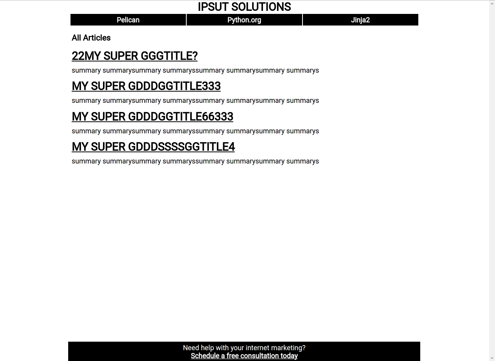

astringent
======
**astringent** is a theme for the [Pelican](https://github.com/getpelican/pelican) static site generator. It is a brutalist inspired 2 color theme. It is used by the Ipsut Solutions blog.

## Screenshot

## Features
* Native [AMP or Accelerated Mobile Pages](https://www.ampproject.org/) support.
* Tiny fast and minimalist.

## unFeatures
* The podcast page is too specific. You would need to edit the `podcast.html` for your needs.

## Version
* Version 0.0 - Alpha

## Docs

###Settings
The theme is installed like any ordinary pelican theme. Add these variables to the pelicanconf.py file. Changing the values appropriately.

    AUTHOR_NAME = "Jason Rigden"
    AUTHOR_TWITTER = "mr_rigden"
    FOOTER_MESSAGE = 'Need help with your internet marketing? <a href="">Schedule a free consultation today</a>'
    GA_PROPERTY_ID = "UA-XXXXX-Y"
    SITE_LOGO = "Picture of Pine Trees"
    SITE_TWITTER = "ipsut_solitions"

###Articles

Articles have several unique values. These are used by AMP features.

 **featured_image** - *need to be image of width 1920 and height of 1080*
 **youtube** - *youtube id*
  **podcast_url** - *url of mp3 file*

## Contact
#### Developer/Company
* Jason Rigden
* [Ipsut Solutions LLC](https://ipsut.net)
* e-mail: jason@ipsut.net
* Twitter: [@mr_rigden](https://twitter.com/mr_rigden "mr_rigden on twitter")
